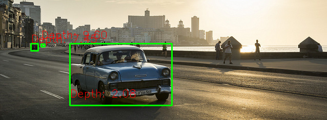

# Car Detection and Distance Measurement Based on Monodepth v2 and Detectron v2
We merge this tweo to do car distance detection
## Monodepth v2
This is the reference PyTorch implementation for training and testing depth estimation models using the method described in

> **Digging into Self-Supervised Monocular Depth Prediction**
>
> [Clément Godard](http://www0.cs.ucl.ac.uk/staff/C.Godard/), [Oisin Mac Aodha](http://vision.caltech.edu/~macaodha/), [Michael Firman](http://www.michaelfirman.co.uk) and [Gabriel J. Brostow](http://www0.cs.ucl.ac.uk/staff/g.brostow/)
>
> [ICCV 2019 (arXiv pdf)](https://arxiv.org/abs/1806.01260)

<p align="center">
  
</p>

This code is for non-commercial use; please see the [license file](LICENSE) for terms.

To cite their paper:

```
@article{monodepth2,
  title     = {Digging into Self-Supervised Monocular Depth Prediction},
  author    = {Cl{\'{e}}ment Godard and
               Oisin {Mac Aodha} and
               Michael Firman and
               Gabriel J. Brostow},
  booktitle = {The International Conference on Computer Vision (ICCV)},
  month = {October},
year = {2019}
}
```

## Detectron2
<a href="https://opensource.facebook.com/support-ukraine">
  
</a>

Detectron2 is Facebook AI Research's next generation library
that provides state-of-the-art detection and segmentation algorithms.
It is the successor of
[Detectron](https://github.com/facebookresearch/Detectron/)
and [maskrcnn-benchmark](https://github.com/facebookresearch/maskrcnn-benchmark/).
It supports a number of computer vision research projects and production applications in Facebook.

<div align="center">
  
</div>
<br>

Learn More about Detectron2

Explain Like I’m 5: Detectron2            |  Using Machine Learning with Detectron2
:-------------------------:|:-------------------------:
[](https://www.youtube.com/watch?v=1oq1Ye7dFqc)  |  [](https://www.youtube.com/watch?v=eUSgtfK4ivk)


## Example of our project
The input image is shown in assets/test_image.jpg              
            
The output image is shown in assets/test_car_dis.png                   
              

## To use it
You need to install mono emvironment by using provided environment: mono2.yml or mono2.yaml by using:              
```python
conda env create -f mono2.yml or conda env create -f mono2.yaml
```
You can run thie code in bush to get the test results:     
```python
python dm.py
```
You can adjust the *line 130* in dm.py to change what class of object that you want to detect, the *line 115* to change the distance variance and the *line 33* to change the pretrained model that you are using in our project.
